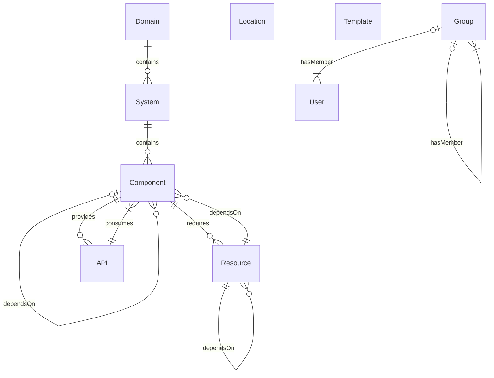
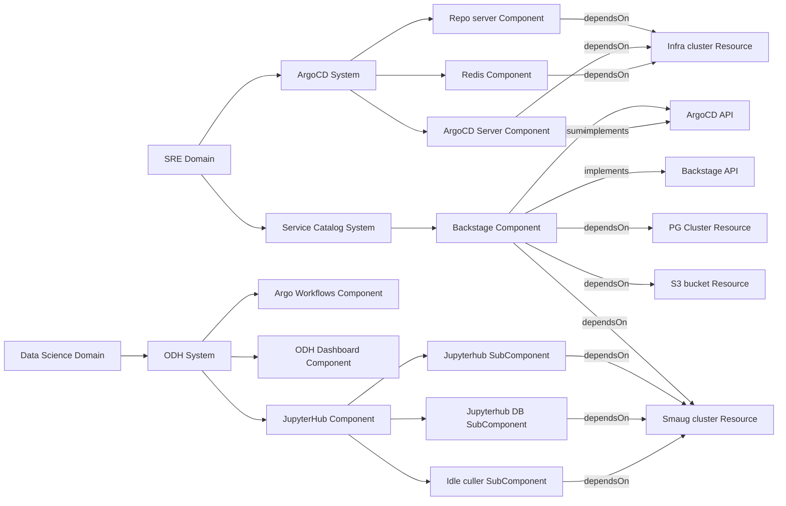

# Rules for entity mapping in Service Catalog

* Status: Proposed
* Deciders: mimotej, SamoKopecky, tumido
* Date: 2022-07-26

## Context and Problem Statement

Backstage offers multiple entity types which can be used to represent entities and their relations in a service catalog. We need to have a set of rules present in Operate First that will provide context and guidance on how entities are mapped to Backstage resources.

## Decision Drivers

* Easy and clear guidelines and distinction for each resource type.
* Supports various caveats like ODH meta operators and Cluster as a service/resource.

## Decision Outcome

[Backstage provides](https://backstage.io/docs/features/software-catalog/descriptor-format) numerous resource types, which has strictly defined relations.

Relations are generated from resource manifests. Extensive documentation on all supported and recognized relations is available [upstream][3].

Additionally:

`Group` and `User` resources own any other resource type. All resources except `Group`, `User` and `Location` is required to have an owner specified.

### Kind: Domain

This entity represents a top-level non-root entity within the cloud. Think of it as a SIG type of entity. A whole collection of applications or group of services that are meant to work together and be used together.

Examples:

* **SRE Domain**: Contains all monitoring applications, CI/CD etc, Service Catalog, etc.
* **Data Science Domain**: Contains ODH and, Kubeflow, Data cataloging solutions and other analytics tools.
* **Thoth Station Domain**: All Thoth related systems including repository storages like Pulp, everything supporting Thoth.

`Domain` owns multiple `System`s.

### Kind: System

System means a collection of applications and components that build a singular service. A system is meant as an interaction point for users as an application.

Examples:

* **Service Catalog System**: Represents Backstage as a whole.
* **ODH System**: Represents ODH as a collection of its components.
* **ArgoCD System**
* **Prow System**: Contains all Prow components like Deck, Crier, Horologium, etc.

`System` resource belongs to a one domain. `System` resource owns `Component` resources.

If there are multiple instances of the same service system, either for different maturity level environments (staging/production) or intended to different audiences (ODH in Smaug and ODH in OS Climate) the System or Component resources need to be duplicated.

### Kind: Component

Individual service, a runtime, component. Usually describes an individual kubernetes `Deployment`. `Component` kind is the most feature rich entity in Backstage, it allows you to track CI/CD, Kubernetes deployment, Grafana dashboards etc. That means `Component` kind should be used for each individual piece of code base, both home grown and external, that is packaged either as a library, dependency, OCI container and so on.

Examples:

* **ArgoCD Repository Server Component**
* **Deck Component of Prow**

In special cases of complicated architectures, where there are multiple entities in between a `Domain`, `System` and a deployment, the `Component` resource can describe a "System-like" resources. The most obvious example here is applications which belong to Open Data Hub:

> Open Data Hub is described as a `System` resource in Data Science `Domain`. Due to lack of intermediate resource types in Backstage, all the applications within Open Data Hub, like Superset, JupyterHub, Argo Workflows, etc. are described as `Component` resources. These resources have subcomponents (specified as `Component` resources with the [`.spec.subcomponentOf` field](https://backstage.io/docs/features/software-catalog/descriptor-format#specsubcomponentof-optional) specified) which finally map to individual deployments

* **JupyterHub Component**
* **JupyterHub Controller subcomponent** `Component` resource
* **Idle culler subcomponent** `Component` resource

The `Component` resource requires a [`.spec.type` field](https://backstage.io/docs/features/software-catalog/descriptor-format#spectype-required) to be specified. While any arbitrary value is allowed here, we recognize following main types:

* `service`: Any backend-like application, API provider, bot
* `website`: Has to provide frontend web interface
* `library`: Provides a library or any sort of code base dependency
* `template`: Is used as a repository or service template

### Kind: API

If a component is a backend service, it may expose an API intended to be consumed by others. Each exposed API should provide an definition, either statically or dynamically. Backstage [requires us to specify](https://backstage.io/docs/features/software-catalog/descriptor-format#kind-api) `.spec.definition` and `.spec.type` fields. Definition should reflect selected type. Additionally `.spec.definition` can directly describe the API verbatim or can reference remote or service provided dynamic API definitions through supported [substitution modifiers](https://backstage.io/docs/features/software-catalog/descriptor-format#substitutions-in-the-descriptor-format).

### Kind: Resource

This resource type represents any other type of dependency of a `Component`. It can be an object bucket, a cluster where the workload is hosted at, etc. Any external dependency that the service relies on. This entity type describes a concrete resource - a specific database cluster, a named S3 bucket and external SaaS/PaaS out of Operate First control.

### Kind: User

Represents individual users.

### Kind: Group

Represents group of users or teams. Composable unit of organization and people structure. Groups should represent individual service owners and contact points.

### Kind: Template

In Backstage this is used for interactive forms. Since all our configuration is declarative, we don't plan on using this entity.

### Kind: Location

Backstage provides this entity type to allow you to extend catalog from other locations. Since our catalog is co-located in a single place, we don't plan on using this entity to reference external locations. Please refrain from creating new `Location`s, instead extend the ones available at [service catalog manifests folder root](https://github.com/operate-first/apps/tree/master/service-catalog).

## Additional notes

### Name, title and description

Each entity is required to feature `.metadata.name` by definition. Additionally it is advised to provide additional details via:

* `.metadata.title` for a display name
* `.metadata.description` for human readable description of the entity

### Annotations

Individual entity types support various annotations, which allow users to enable certain plugins and features. To understand supported annotations, users should refer to our service catalog [documentation][1] and [upstream documentation on annotations][2].

### Tags

All entity types support tagging. While any arbitrary value is allowed, it's better to restrict ourselves so we can use these values for easy filtering and search. Please be considered when using tags and don't be overly specific (unique tag applied to a single resource only is not helpful).

### Links

Additionally you can display links for each entity. Please use them to point to additional documentation, repositories and other resources. See [specification](https://backstage.io/docs/features/software-catalog/descriptor-format#links-optional) for more details.

### Example

In order to understand the mapping better, illustrate it on following well known services:

## Links

* [Upstream YAMl specification in Backstage](https://backstage.io/docs/features/software-catalog/descriptor-format)
* [Service catalog `README.md`][1]
* [Well-known annotations][2]
* [Well-known relations][3]

[1]: https://github.com/operate-first/service-catalog#readme
[2]: https://backstage.io/docs/features/software-catalog/well-known-annotations
[3]: https://backstage.io/docs/features/software-catalog/well-known-relations
